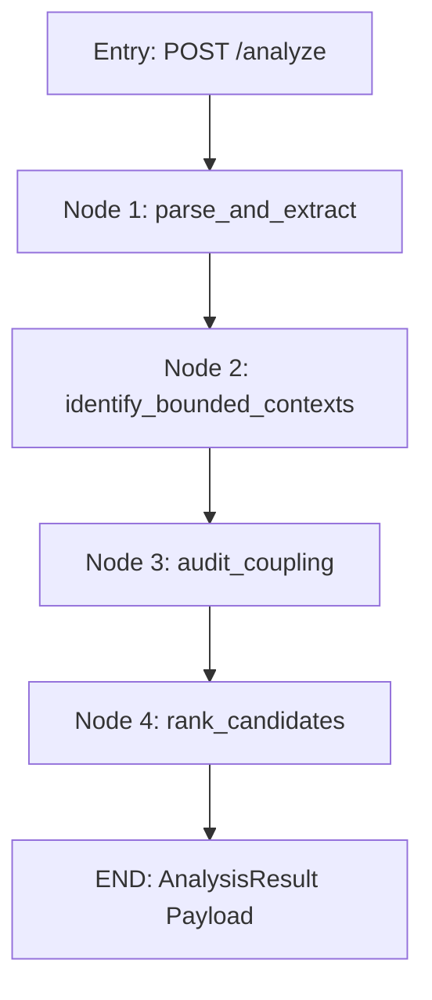

# Repo Decomposition Advisor — Agent Architecture Guide

This document defines the architecture and execution flow for the **LangGraph Repo Decomposition Agent** (built for IBM Bob 2.0 Hackathon).

---

## 📁 Agent Directory Structure (`app/engine/agent/`)

The agent follows the modular **State-Nodes-Graph-Prompts-Tools** design pattern:

```text
app/engine/agent/
├── __init__.py      # Package exports (decomposition_graph, DecompositionState)
├── state.py         # Central LangGraph state schema (DecompositionState TypedDict)
├── nodes.py         # 4 discrete node functions (parse, identify, audit, rank)
├── graph.py         # StateGraph assembly & workflow compiler
├── prompts.py       # System prompts & instructions for IBM Bob 2.0 reasoning
└── tools.py         # AST parser, static proposer, and heuristic scoring bridges
```

---

## 🔄 State Machine & Execution Flow

The workflow is structured as a 4-step Domain-Driven Design (DDD) sequence:



---

## 🧠 State Schema (`app/engine/agent/state.py`)

```python
class DecompositionState(TypedDict):
    job_id: str
    repo_url: str
    repo_ref: str
    repo_path: str
    repo_context: Optional[RepoContext]          # AST-parsed codebase graph
    groupings: List[ServiceGrouping]              # Bounded context candidate services
    scored_services: List[ScoredService]          # Risk-scored services with relationships
    unassigned_modules: List[str]                 # Modules not assigned to any service
    result: Optional[AnalysisResult]             # Final output response payload
    logs: List[str]                               # Execution progress log entries
```

---

## ⚡ The 4 Core Graph Nodes (`app/engine/agent/nodes.py`)

1. **`node_parse_and_extract` (Step 1 — Event Storming & AST Parsing)**
   - Walks repository files, parses imports via `ast`, and maps SQL/ORM database table operations.
   - Appends progress log: `"[Step 1/4] Parsed repository..."`.

2. **`node_identify_bounded_contexts` (Step 2 — Bounded Context Identification)**
   - Groups modules into candidate microservices based on domain capability boundaries.
   - Appends progress log: `"[Step 2/4] Identified bounded context candidate services."`.

3. **`node_audit_coupling` (Step 3 — Coupling & Data Ownership Audit)**
   - Calculates 3-signal heuristic risk scores ($0.45 \cdot S_{\text{data}} + 0.35 \cdot S_{\text{calls}} + 0.20 \cdot S_{\text{density}}$).
   - Maps explicit `creates`/`reads` relationships and sets `produced_by` owners.
   - Appends progress log: `"[Step 3/4] Evaluated shared writes, call frequency, and data relationships."`.

4. **`node_rank_candidates` (Step 4 — Candidate Ranking & Output Formatting)**
   - Sorts candidate services by risk score, `fan_out_count`, and external dependencies.
   - Assigns `recommended_extraction_order` (1, 2, 3...) and formats `AnalysisResult`.
   - Appends progress log: `"[Step 4/4] Ranked extraction candidates and generated final analysis output."`.

---

## 🛠️ API & Endpoint Integration (`app/api/endpoints.py`)

When `POST /analyze` is called, the background pipeline executes:

```python
from app.engine.agent import decomposition_graph, DecompositionState

initial_state: DecompositionState = {
    "job_id": job_id,
    "repo_url": repo_url,
    "repo_ref": repo_ref,
    "repo_path": tmp_dir,
    "repo_context": None,
    "groupings": [],
    "scored_services": [],
    "unassigned_modules": [],
    "result": None,
    "logs": [],
}

final_state = await asyncio.to_thread(decomposition_graph.invoke, initial_state)
```

Frontend retrieves progress via `GET /analyze/{job_id}/status` and final result payload via `GET /analyze/{job_id}/result`.
