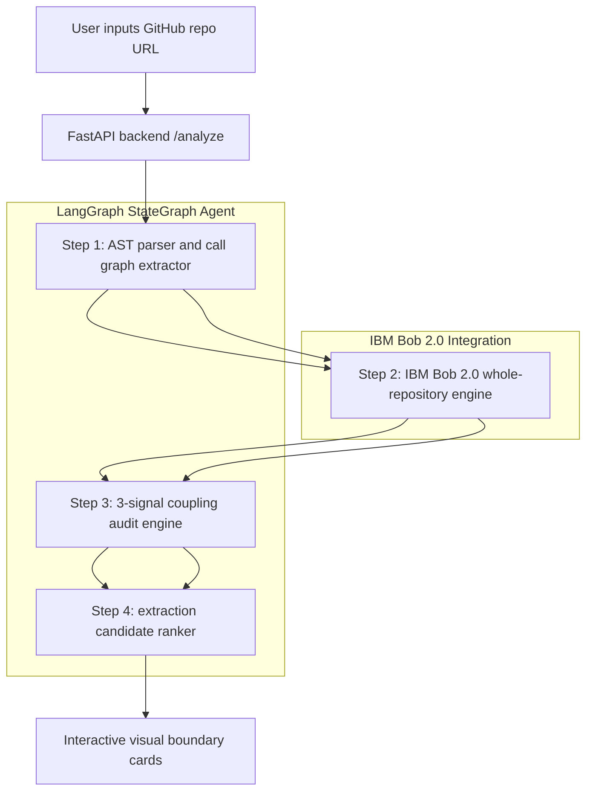

# Rubix Documentation

Welcome to the documentation for Rubix — the Repository Decomposition Advisor.

Rubix helps engineering teams analyze monolithic repositories and identify safer, more maintainable microservice boundaries. It combines repository-wide reasoning, dependency analysis, and extraction guidance to turn architecture refactoring from guesswork into a measurable process.

## What Rubix does

Rubix analyzes a GitHub repository and identifies:

- bounded contexts and likely domain groupings
- cross-module dependency patterns
- shared database write risks
- service ownership and producer/consumer relationships
- candidate microservice extraction opportunities
- recommended refactoring order with risk scoring

## Why this matters

Modern monoliths hide coupling in ways that make decomposition risky:

- shared database tables
- cross-module function calls
- implicit domain ownership conflicts
- unclear microservice extraction boundaries

Rubix reduces this risk by combining static analysis, whole-repository reasoning, and a quantitative coupling audit.

## Executive summary

Modernizing monolithic applications into microservices is one of the highest-friction tasks in software engineering. Decoupling a monolith requires tracing cross-module function calls, shared database tables, and implicit domain dependencies across thousands of lines of code.

Manual refactoring relies on weeks of tribal guesswork. Making the wrong architectural cut results in high-latency distributed monoliths, circular dependencies, and cascading production failures.

Rubix (Repo Decomposition Advisor) automates Domain-Driven Design decomposition by pairing IBM Bob 2.0 whole-repository reasoning with a four-step LangGraph state graph and a three-signal quantitative coupling heuristic.

Rubix turns weeks of dangerous refactoring guesswork into a short, automated, and verifiable microservice extraction roadmap.

## Core value propositions

1. Four-step DDD LangGraph agent
   - Executes domain event extraction, bounded context discovery, coupling auditing, and candidate ranking.
2. Whole-repository reasoning via IBM Bob 2.0
   - Analyzes semantic relationships across files and modules, rather than isolated snippets.
3. Producer/consumer ownership tracking
   - Distinguishes services that create a resource from services that only read it.
4. Three-signal quantitative coupling score
   - Evaluates shared database writes, call frequency, and dependency density.
5. Recommended extraction priority
   - Tags candidates with extraction order such as "#1 Extract First".

## High-level architecture

## Target audience

- software architects planning monolith modernization
- engineering managers assessing refactoring risk
- DevOps and cloud engineers designing cleaner service boundaries
- platform teams evaluating extraction feasibility

## Documentation sections

- [Overview](overview.md)
- [Architecture and IBM Bob 2.0](architecture.md)
- [Data ownership model](data-ownership-model.md)
- [API reference](api-reference.md)
- [IBM Bob IDE guide](bob-ide-guide.md)
- [Hackathon judge checklist](hackathon-judge-checklist.md)

## Live project links

- Landing page: https://rubix-landing.pxxl.click
- Production app: https://rubix.pxxl.click/
- Backend API docs: https://rubixbackend.pxxl.click/docs
- GitHub backend repo: https://github.com/techbyFEMI/Rubix_backend.git

## Deployment note

This documentation is prepared for static hosting on GitHub Pages and keeps the original Rubix project information while using standard Markdown structure.

## Summary

Rubix is a practical architecture intelligence tool for teams modernizing monoliths into cleaner microservice boundaries. It helps organizations reduce refactoring risk by making model ownership, dependency intensity, and extraction priorities visible before major service cuts are made.
