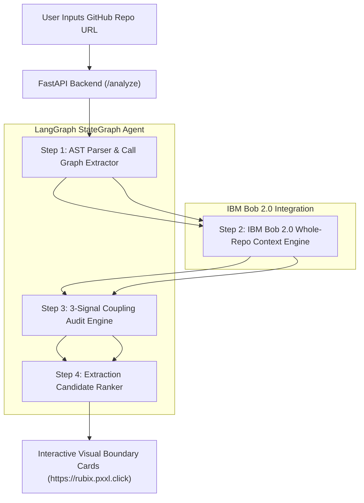

# 🚀 Rubix — Repository Decomposition Advisor

> **AI-Powered Microservice Boundary Advisor built for IBM Bob 2.0 & LangGraph**  
> **Live Application**: [https://rubix-landing.pxxl.click](https://rubix-landing.pxxl.click)  
> **Production Web App**: [https://rubix.pxxl.click/](https://rubix.pxxl.click/)  
> **Backend Repository**: [https://github.com/techbyFEMI/Rubix_backend.git](https://github.com/techbyFEMI/Rubix_backend.git)

---

## 📌 Executive Summary

Modernizing monolithic applications into microservices is one of the highest-friction tasks in software engineering. Decoupling a monolith requires tracing cross-module function calls, shared database tables, and implicit domain dependencies across thousands of lines of code.

Manual refactoring relies on weeks of tribal guesswork. Making the wrong architectural cut results in **high-latency distributed monoliths**, circular dependencies, and cascading production failures.

**Rubix (Repo Decomposition Advisor)** automates Domain-Driven Design (DDD) decomposition by pairing **IBM Bob 2.0 whole-repository context reasoning** with a **4-step LangGraph state graph agent** and a **3-signal quantitative coupling heuristic**. 

Rubix turns weeks of dangerous refactoring guesswork into a **60-second automated, verifiable microservice extraction roadmap**.

---

## ✨ Key Value Propositions

1. **4-Step DDD LangGraph Agent**: Executes automated domain event extraction, bounded context discovery, coupling auditing, and candidate ranking.
2. **Whole-Repository Reasoning via IBM Bob 2.0**: Unlike standard LLM prompts that analyze isolated code snippets, IBM Bob 2.0 analyzes multi-file semantic relationships across complex monoliths.
3. **Producer / Consumer Resource Ownership Tracking**: Explicitly distinguishes services that merely read data from services that **create a resource another service depends on** (`creates` vs `reads` with `produced_by` owner tags).
4. **3-Signal Quantitative Coupling Score**: Evaluates shared database writes ($S_{\text{data}}$), call frequency ($S_{\text{calls}}$), and dependency graph density ($S_{\text{density}}$) to score boundary safety from `0.00` (Clean Cut) to `1.00` (Deep Entanglement).
5. **Recommended Extraction Priority**: Tags candidate services with optimal refactoring order (`#1 Extract First`) based on domain isolation and low dependency fan-out.

---

## 🏗️ High-Level Architecture Diagram

---

## 🎯 Target Audience

* **Software Architects**: Planning legacy monolith modernization and microservice migration.
* **Engineering Managers**: Evaluating architectural refactoring risk before allocating developer quarters.
* **DevOps & Cloud Engineers**: Designing clean service boundaries for containerization and Kubernetes deployments.
