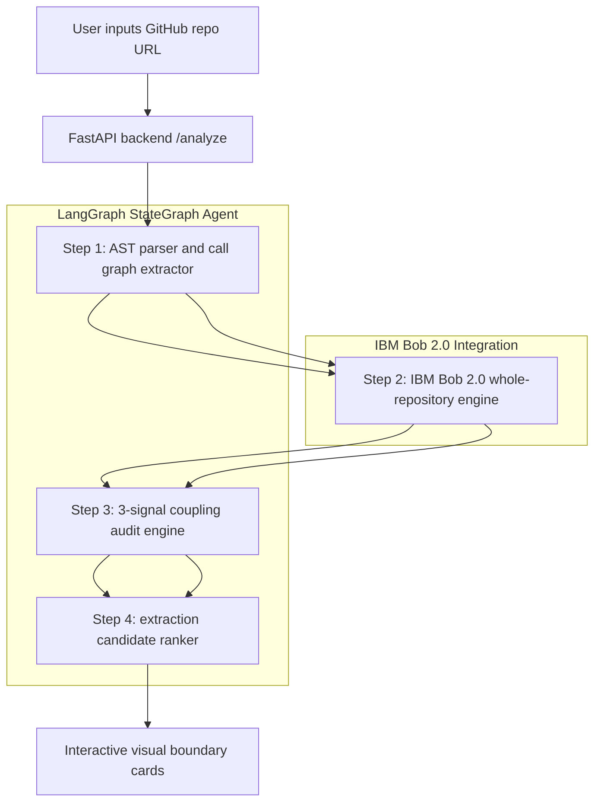

# Rubix Overview

## Executive summary

Modernizing monolithic applications into microservices is one of the highest-friction tasks in software engineering. Decoupling a monolith requires tracing cross-module function calls, shared database tables, and implicit domain dependencies across thousands of lines of code.

Manual refactoring relies on weeks of tribal guesswork. Making the wrong architectural cut results in high-latency distributed monoliths, circular dependencies, and cascading production failures.

Rubix (Repository Decomposition Advisor) automates Domain-Driven Design decomposition by combining IBM Bob 2.0 whole-repository reasoning with a four-step LangGraph state graph pipeline and a three-signal quantitative coupling heuristic.

Rubix turns weeks of risky refactoring guesswork into a short, automated, and verifiable microservice extraction roadmap.

## Core value propositions

1. Four-step DDD LangGraph agent
   - Executes domain event extraction, bounded context discovery, coupling auditing, and candidate ranking.
2. Whole-repository reasoning via IBM Bob 2.0
   - Analyzes semantic relationships across files and modules rather than isolated code snippets.
3. Producer/consumer ownership tracking
   - Differentiates services that create a resource from services that only read it.
4. Three-signal quantitative coupling score
   - Evaluates shared database writes, call frequency, and dependency density.
5. Recommended extraction priority
   - Tags candidates with extraction order, such as "#1 Extract First".

## High-level architecture

## Target audience

- software architects planning monolith modernization
- engineering managers assessing refactoring risk
- DevOps and cloud engineers designing cleaner service boundaries
- product and platform teams evaluating extraction feasibility

## Project goals

Rubix is designed to reduce architectural uncertainty by making microservice extraction safer, more explainable, and more measurable.

It supports a workflow where engineers can:

- submit a monolithic repository for analysis
- inspect inferred domain boundaries
- view coupling and ownership signals
- identify the best extraction candidates
- prioritize a refactoring plan with evidence

## Summary

Rubix is a practical architecture intelligence tool for teams dealing with monolithic codebases that need to transition toward independently deployable services without blindly splitting the system.
